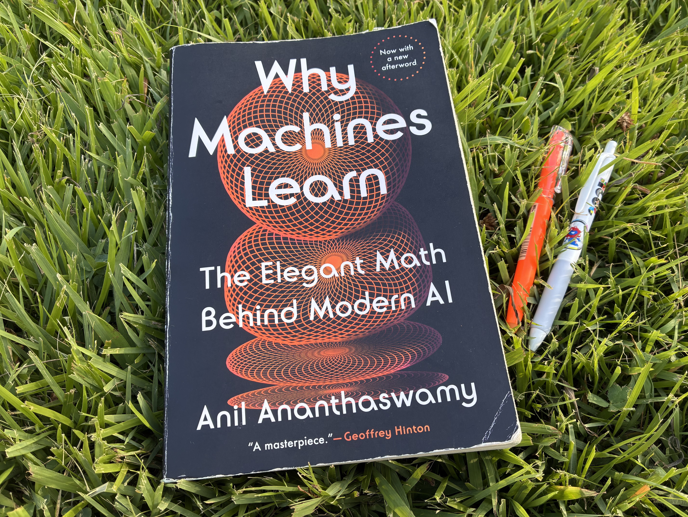
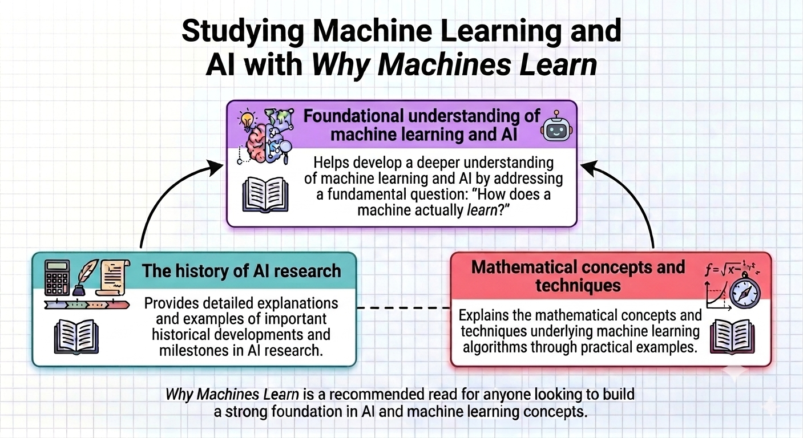
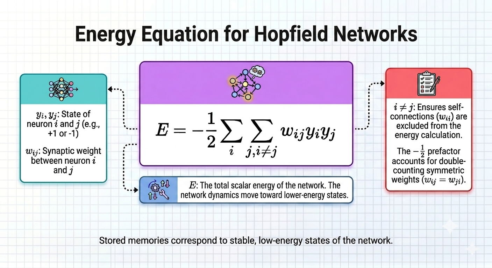
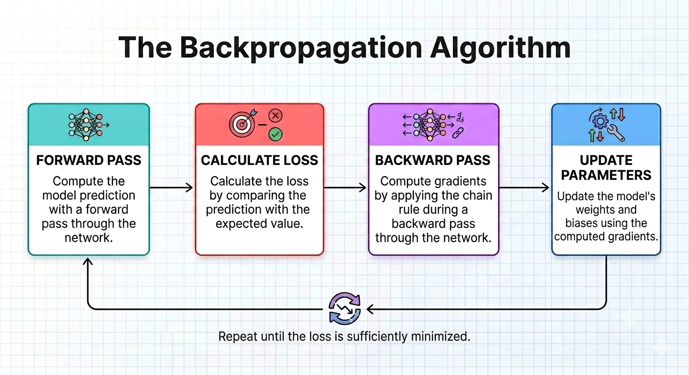
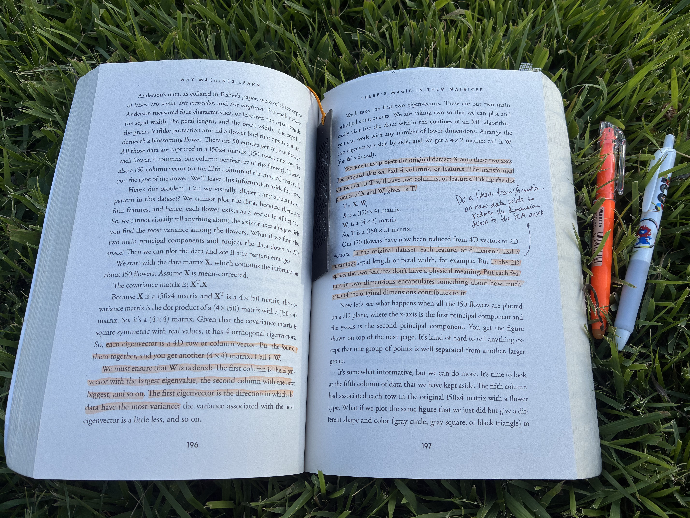

# Book Review - _Why Machines Learn: The Elegant Math Behind Modern AI_

_Photo taken in one of my favorite places to study: outside in a park._

## Introduction

From Fall 2025 to Spring 2026, I took my first major step in formalizing my education in machine learning and AI after completing the Applied AI & Data Science program with MIT Professional Education. In addition to practical applications, the courses covered the theoretical background behind AI and machine learning techniques, which inspired me to learn more about how mathematical concepts like statistics, calculus, and linear algebra form the backbone of the algorithms used in modern AI-powered technology. From partial derivatives in the gradient descent algorithm, to matrix manipulation in the transformer architecture, I was amazed to see how the mathematics that I had studied in high school and college has been applied so creatively and so intuitively to computing, enabling machines to perform tasks that resemble aspects of human decision-making. Whether it be a chatbot or a movie recommendation system, mathematics is the driving force behind the AI services that we use in our everyday lives.

With a desire to dive deeper into the theory behind AI and machine learning, I went searching for books about the subject at a nearby bookstore and luckily stumbled upon _Why Machines Learn: The Elegant Math Behind Modern AI_, by [Anil Ananthaswamy](https://anilananthaswamy.com/). Once I read a few pages, I quickly realized that the book approached AI from exactly the perspective that I was looking for: the mathematical foundations underlying modern machine learning systems. After reading the book, I developed a deeper appreciation for all the work of scientists who contributed to the field and applied mathematics in such a unique way to make all the AI-powered technology in the world today a reality.

This book helps answer a question that many people might have when they start learning about AI: how does a machine actually _learn_? The author structured the book in a way that helps the reader understand both the history behind AI research and the applications of mathematics in machine learning algorithms with thorough introductions, explanations, and examples, making it a recommended read for anyone looking to build a strong foundation in AI and machine learning concepts.

_Image created with the help of Google Gemini._

The following are some of the key insights and personal learnings that I drew from the book, as well as some areas that the book inspired me to explore further.

## Key Insights

### The History of AI Research and Influence from Other Fields

#### The MCP Neuron and the Perceptron

When introducing new concepts in the book, Ananthaswamy first dives into the history behind them, including key people, important publications, and their impact on AI-related research. This approach helped me develop a more intuitive understanding of machine learning by showing how many of its foundational ideas emerged from attempts to understand intelligence itself.

In particular, the book begins with two groundbreaking milestones in the field: the MCP Neuron and the Perceptron, two foundational models of the artificial neuron inspired by neuroscience and other fields. Rather than introducing these concepts as purely mathematical models, Ananthaswamy first places them within the historical context of early attempts to understand human intelligence through biology, psychology, and logic. This style helped me realize that many ideas in machine learning originated from interdisciplinary efforts decades before advances in computing power made modern large-scale AI possible.

From a mathematical standpoint, one aspect that struck me most was how a seemingly simple model like the Perceptron became the foundation for much of modern machine learning. At its core, the Perceptron can be viewed as a multidimensional linear model of the form $y = a_1x_1 + a_2x_2 + ... + a_nx_n + b$. While the mathematics behind the model is relatively straightforward, the idea that such a simple formulation could serve as the basis for increasingly sophisticated neural networks gave me a deeper appreciation for how powerful mathematical abstractions can be.

#### The Origins of Artificial Neural Networks

Similar to how neuroscience influenced the artificial neuron, artificial neural networks (ANNs) have their roots in discoveries from neurobiology. In a chapter dedicated to computer vision, Ananthaswamy shares a historical episode about research on the visual cortex and how it contributed to the development of ANNs. One of the most fascinating aspects of this chapter was reading about how biological models of visual neuron activity were translated into mathematical models that enabled a machine to _see_.

Drawing inspiration from visual fields, receptive fields, and visual neurons, computer vision researchers in the 1970s and 1980s developed layered networks of artificial neurons that could progressively identify complex visual patterns based on how they activated (or "fired") in response to stimuli. The first layers in these networks detect features in focused regions of an input image, while later layers extract those features into higher-level representations to find unique patterns that can ultimately be used for image classification. This process continues until the data is progressively transformed into increasingly compact feature representations that can capture the broader pattern of the image. After assigning weights to each neuron connection to make the neurons fire in a specific way depending on which pattern they need to classify, a computer could recognize the pattern again once fed in a new input. 

What fascinated me the most about this history behind ANNs is how a biological system, which on the face does not appear to be mathematical in nature, can be converted into a numerical computation by describing it in terms of inputs, processes, and outputs. More broadly, it reinforced the idea that mathematics is often not confined to traditional mathematical problems. Instead, it can serve as a language for modeling phenomena from various disciplines, transforming real-world observations into algorithms that machines can execute. This revealed to me the importance of thinking outside of the box and extending outside of the immediate scope of mathematics to search for inspiration that can lead to advances in computational methods.

The section of the book on ANNs also taught me that research and development is rarely an isolated process. Early neural network architectures demonstrated the ability to detect visual patterns, but they also conveyed limitations in efficiency and scalability that motivated further research and led to the development of convolutional neural networks (CNNs), which are still widely used in image recognition today. One lesson I took from this episode is that research is fundamentally iterative. Rather than replacing earlier ideas entirely, subsequent developments often build upon them through new innovations.

Having previously implemented CNNs in a digit recognition project during my MIT Professional Education studies, I found it especially rewarding to learn the historical ideas that paved the way for these techniques. Rather than viewing convolution and filtering simply as algorithms, I came to appreciate them as a culmination of extensive interdisciplinary research spanning neuroscience, mathematics, and computer science.

> _📝 **Note:** A cleaned version of my digit recognition project is available in [my GitHub portfolio](https://github.com/kabresson1/svhn-digit-recognition)._

#### Inspirations from Physics

How does the human brain store memories? How can we create a machine that _remembers_ a pattern, just as humans do? At first glance, these questions appear to be completely unrelated to physics. And yet, a clever application of magnetic moments and energy in ferromagnets led to the development of the Hopfield Network, an early type of ANN designed by physicist John Hopfield.

Ananthaswamy describes this episode in the book, and what piqued my interest the most was the creative approach that Hopfield took to solve a computer science problem by first addressing a core question in neuroscience and then applying his physics expertise. He recognized that neural activity in the human brain can be treated as a dynamical system, where neurons perform some computation to transmit signals to other neurons, changing the state of the overall system as they propagate information. By recognizing a connection between neural activity and the tendency of atoms and ions in ferromagnetic materials to settle into low-energy states, Hopfield devised a framework in which learned patterns could be stored as stable configurations of a network. He accomplished this by calculating the network's "energy" using learned weights between neurons. 

Although the original system design is different from the modern Hopfield networks in use today, Hopfield's discovery was not only a major advancement in machine learning, but also a brilliant application of dynamical systems and modeling to solve a scientific problem. I believe that Hopfield's story shows how dynamical systems are a common occurrence in nature and can be applied to almost any field, which encouraged me to continue learning more about applied mathematics. On a side note, the equation for the system energy of a Hopfield Network is quite beautiful:

_Image created with the help of Google Gemini._

Ananthaswamy includes several quotes from his interview with Hopfield in the book, so I highly recommend this section of the book to anyone interested in interdisciplinary sciences and applied mathematics!

### The Diversity of Applied Mathematics in Machine Learning and AI

#### How Probability and Statistics Shape AI Decision-Making

When making decisions, humans use evidence like personal knowledge, experience, and expert opinion to weigh options before determining the optimal path to take. In much the same way, machines analyze data and make _decisions_ based on computational methods from probability and statistics. AI and many machine learning models are fundamentally probabilistic rather than deterministic, which is why their outputs are generally interpreted as predictions or estimates rather than certain facts (and, consequently, why large language models are subject to hallucination).

_Why Machines Learn_ helped me build a deeper understanding of probability theory in general and how it makes AI and machine learning models possible. One concept in particular that is covered in detail in the book is Bayes' Theorem. Although I was familiar with the theorem's formula, I had not yet dug deeper to find out what information the theorem was actually conveying: a mathematical framework for updating beliefs about a hypothesis in light of new evidence through the use of "prior" and "posterior" knowledge. While reading the book, I took out a notebook and started jotting down equations and diagrams, connecting evidence with hypotheses and vice versa to uncover the relationships that the formula describes. I started seeing both the theorem and probability in general as proportions rather than just a set of equations for crunching numbers, which is an insight that I will keep with me when studying applied mathematics and statistics from here on.

Ananthaswamy also showed how Bayes' Theorem is used in action with an example from zoology, where he explains how it can be applied to non-linear classification problems by using probability distributions instead of linear relationships to predict outcomes. What fascinated me was that the theorem is not merely a mathematical identity: it provides a practical framework for reasoning under uncertainty. Seeing it applied to a real-world classification problem helped me appreciate why probability theory remains fundamental to modern machine learning.

#### Principal Component Analysis: Where Statistics and Linear Algebra Intersect

At one of my classes with the MIT Professional Education program, Professor Caroline Uhler was explaining dimensionality reduction, and how high-dimensional data can make analysis and visualization both difficult and computationally expensive. She introduced the concept of Principal Component Analysis (PCA), which is a powerful tool for reducing the dimensionality of multi-variate data by identifying new directions, called principal components, that capture as much of the variation in the data as possible and can be used to project the original data into a lower-dimensional space. There was one practical example of PCA that Professor Uhler gave that I will never forget: a visualization of genetic variation across Europe. The original dataset contained measurements across several dimensions, but PCA was used to compress the information into just two principal components, producing a 2D scatter plot that closely resembled a map of Europe (see [here](https://pmc.ncbi.nlm.nih.gov/articles/PMC2735096/) for the actual article). It was amazing to see how a mathematical algorithm could recover geographic structure without being given a map.

When I encountered PCA again in _Why Machines Learn_, I realized that what initially appeared to be just another algorithm in the machine learning toolbox was actually a beautiful synthesis of two branches of mathematics: statistics and linear algebra. Statistics is applied when constructing the covariance matrix, which describes how variables in a dataset vary both individually and collectively, while linear algebra is used to compute the eigenvectors and eigenvalues of that matrix. The eigenvectors define the principal directions of variation in the data, while the corresponding eigenvalues quantify how much of the total variance is explained along each of those directions. In this way, a statistical object becomes a geometric one: variance and covariance determine the shape of the covariance matrix, while eigenvalues summarize how much of the variation is captured along each principal direction. The principal directions are then used to transform the original data into a lower-dimensional coordinate system while preserving as much information as possible.

Before this realization, I viewed statistics as a way to analyze and summarize data, and linear algebra as a framework for describing geometric spaces through vectors, matrices, and linear transformations. But Ananthaswamy's chapter on PCA revealed to me that these subjects naturally complement one another: statistics describes the structure of data, while linear algebra uncovers that structure through geometric transformations. This completely changed the way I think about mathematics—not as isolated fields of study, but as interconnected tools for understanding complex systems.

#### Backpropagation: Algorithmic, Scalable Optimization

Of all the mathematical fields that have contributed to AI development, I found calculus to be the most surprising. I previously associated concepts like integrals and derivatives with the physical sciences and engineering, and never imagined that the same ideas could teach a computer how to learn. This book showed me how important the role of calculus is in machine learning and reshaped my understanding of how derivatives can be used to solve optimization problems algorithmically. 

One recurrent theme in _Why Machines Learn_ is the "loss function": during the training process, a machine learning algorithm makes a prediction, compares it to the expected result, and then calculates the error (the loss). At first, every machine learning model begins with imperfect predictions, so the main goal of the training process is determining how each parameter in the model should be adjusted to reduce those errors. Ananthaswamy's explanations of the loss function taught me that this is fundamentally an optimization problem: given a function that measures prediction error (the loss function), how can we adjust the model to minimize the loss? This is where calculus, and specifically derivatives, becomes essential, since they describe the rate of change and indicate where a function's maxima and minima are (if they exist). Since machine learning models are composed of mathematical functions parameterized by weights and biases, we can use derivatives to determine how the loss changes with respect to each weight and bias in the model. This provides a systematic way to determine which directions (positive or negative) and which magnitudes of the weights and biases reduce the prediction errors.

Ananthaswamy goes deeper into this idea by exploring loss optimization with multi-layer neural networks, and provides a brilliant overview of the backpropagation algorithm. A neural network is not just one mathematical function, but instead a long composition of functions, where each layer of the network performs its own transformation on the input data before propagating the result to the next. This makes the loss optimization problem significantly more complex. The backpropagation algorithm, however, is an elegant way to solve this complexity by using gradients and the chain rule of derivatives recursively. After computing the overall model prediction and corresponding loss, the algorithm works backward through the network, repeatedly applying the chain rule to compute the gradients associated with each layer, which are then used to update the model's weights and biases before repeating the process on the next batch of data (see below for a rough diagram of this process).

In practice, the backpropagation algorithm is more sophisticated than this simplified description, making use of optimization methods such as gradient descent and Adam, together with carefully selected learning rates, to update the model efficiently and promote stable convergence during training. But Ananthaswamy's chapter on backpropagation taught me how optimization is not merely a mathematical calculation, but a computational process that can be performed algorithmically, and it was one of the clearest examples I have encountered about the subject. I left the chapter with a deeper appreciation for how the concepts that I had learned in calculus became the mechanism by which a machine can iteratively improve its own predictions—and, in a very real sense, _learn_.

_Image created with the help of Google Gemini._

## Personal Learnings and Connections to Future Study

### Key Takeaways

Machine learning is a vast and complex multidisciplinary field with a history spanning more than 150 years, making it difficult to summarize in a single book. Yet _Why Machines Learn_ succeeds in providing a comprehensive introduction to the ideas, people, and mathematical discoveries that have shaped modern AI. Ananthaswamy's clear explanations of both historical developments and mathematical concepts greatly deepened my understanding of the subject, and I highly recommend the book to anyone looking to build a strong foundation in machine learning and AI.

For me personally, the book broadened my perspective on scientific research and deepened my appreciation for applied mathematics. Rather than viewing probability, linear algebra, calculus, and optimization as separate subjects, I began to see them as complementary tools for describing and understanding complex systems. Equally important, I came to appreciate how advances in machine learning often emerge from the intersection of multiple disciplines, with ideas from biology, neuroscience, physics, statistics, and mathematics building upon one another over decades of research. I also began to see machine learning models less as collections of isolated algorithms and more as dynamic mathematical systems whose behavior emerges from the interaction of many different concepts. As a result, _Why Machines Learn_ has become one of my primary references as I continue studying AI, machine learning, and applied mathematics. I expect to revisit it many times as I deepen my understanding of these fields.

### Looking Ahead

_Why Machines Learn_ provides readers with a solid introduction to the mathematics used in machine learning, and I believe that it can serve as a launchpad for further studies in both applied mathematics and AI systems. The book has inspired me to explore these fields in more detail, strengthening my interest in scientific discovery and inspiring me to explore several research questions of my own. Below are just a few of the follow-up areas that I plan to work on going forward:

* __Implement a Perceptron from scratch.__ After learning the history behind the Perceptron and seeing how it forms the building blocks of neural networks, I plan to build and train a simple Perceptron to see first-hand how pattern recognition and learning can emerge from optimizing an individual neuron's weights and biases.
* __Explore the geometry behind PCA.__ In the chapter on PCA, Ananthaswamy shared a stunning phenomenon about the relationship between the eigenvectors of covariance matrices and the major and minor axes of ellipses. I would like to dive deeper into this phenomenon to build a stronger intuition for how PCA makes dimensionality reduction possible.
* __Implement backpropagation at scale from first principles.__ At a high level, the backpropagation algorithm is both simple and beautiful. But putting it into practice is key, so I plan to learn how gradients, the chain rule, and matrix operations enable efficient optimization across multiple layers and millions of parameters in modern neural networks.
* __Connect machine learning to robotics.__ Among the many applications of AI, I am especially interested in autonomous robots and drones. As a follow-up study to this book, I would like to investigate how concepts such as perception, optimization, and neural networks are implemented in physical AI systems for obstacle detection, autonomous navigation, and human-robot interaction.
* __Study why deep neural networks generalize.__ The last chapter of _Why Machines Learn_ ends perfectly by leaving the reader curious to learn more about the future of machine learning and AI. In particular, Ananthaswamy highlights one of the most fascinating open questions in machine learning: why highly complex, multi-parameter neural networks often generalize remarkably well despite having a capacity to overfit training data. I look forward to catching up with the latest research and following future developments in this area. 

Reflecting on this book overall, I believe that it improved my understanding of mathematics as a universal language for modeling and understanding complex systems. Also, perhaps one of the most important discoveries that I made while reading it is that learning is not simply about acquiring new knowledge, but also about asking better questions and developing a deeper understanding of why things work the way they do. Each chapter answered one question while naturally raising several new ones to explore, which I believe shows how scientific progress is an iterative process of curiosity, exploration, and refinement. I hope to continue this learning process through future projects, technical writing, and graduate study, deepening my understanding of both mathematics and AI along the way. Finally, I would like to thank Anil Ananthaswamy for sharing his knowledge through this remarkable book. It has deepened my appreciation for mathematics, machine learning, and scientific discovery, and has inspired me to always learn and be curious!

If this review encourages even one reader to go beyond AI applications and dive deeper to discover the mathematics that makes them possible, then it will have achieved its goal.

_One of my annotated pages while reading Why Machines Learn. This was one of the moments where I realized how statistics and linear algebra naturally come together in PCA to transform a high-dimensional dataset into a lower-dimensional representation along its principal component directions._