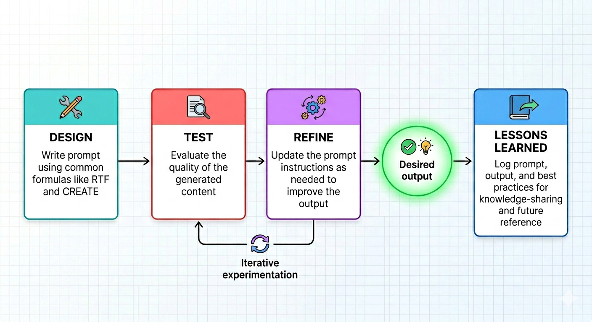
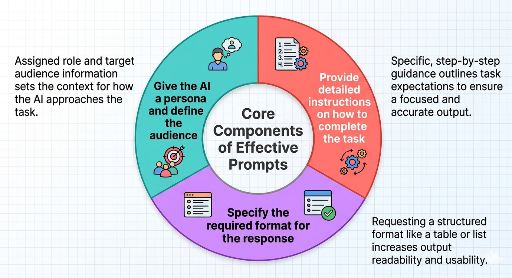
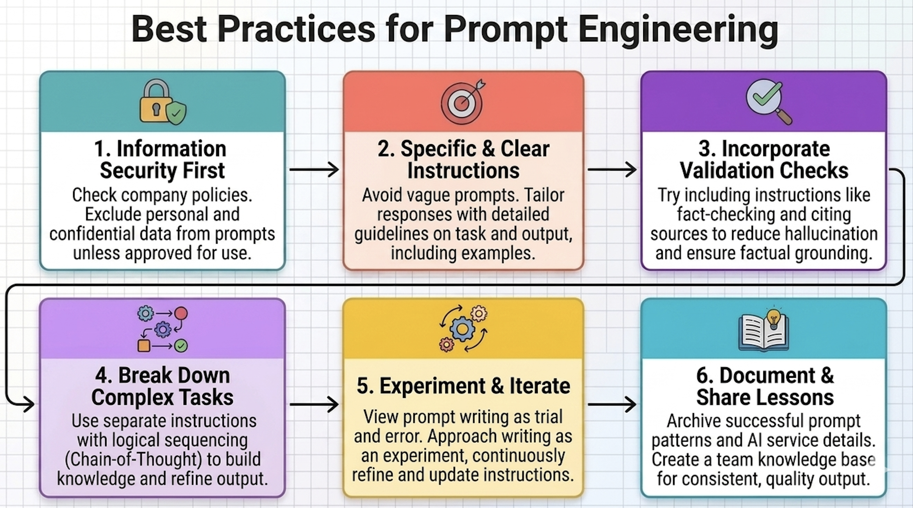

# Best Practices for Prompt Engineering

## Introduction

In an age where generative AI tools like ChatGPT can create images that blur the line between what is real and what is artificial, it is now possible to create almost anything we imagine with only a few prompts and a couple of clicks. Despite the growing availability and user-friendly nature of generative AI services, using them effectively for practical and productive work can still be a daunting task, especially when trying to automate routine or time-consuming processes.

Casually conversing with AI, seeking advice, or requesting information may already feel second nature to many people. However, using AI to create professional documents, generate visualizations, analyze data, or support business workflows is an entirely different challenge. For example, a simple and vague request to create a business plan may result in an unnecessarily long document filled with multiple sections and headers, yet lacking a clear and concise message.

This is where prompt engineering comes into play. Prompt engineering is the practice of structuring AI instructions to produce more accurate, useful, and consistent outputs. It involves writing and structuring prompts for a specific objective, then testing, evaluating, and iteratively improving them until the desired result is achieved. This process may also include providing the AI with feedback about the quality, structure, or accuracy of its responses. At its core, prompt engineering is essentially communicating with AI systems in a deliberate and structured way using natural language.



_Image prepared using Google Gemini_

Learning how to apply prompt engineering techniques effectively can require experimentation and practice, particularly in professional or business settings where the quality of output is critical. In the following sections, we will explore several commonly used prompting methods, practical best practices, and a short experiment demonstrating how prompt engineering can improve AI-generated outputs using infographic creation as an example.

## Common Prompt Formulas

One of the biggest differences between simple conversations with AI and prompt engineering is the use of prompt formulas to structure requests. Prompt formulas help create a logical flow that is easy for the AI to process and provide a clear and concise format for instructions. They serve as structured frameworks for organizing prompts in a way that improves the likelihood of generating useful outputs.

While prompt formulas vary in structure and terminology, most effective prompts share three core components:

**1. Give the AI a persona and define the audience**

This component involves assigning the AI a specific role that it can use as context for how to complete the task. It helps set the stage for the request details and gives the AI a reference point for generating content. For example, if the goal of the task is to provide an executive summary of some statistics, then giving the AI a persona like _You are a business analyst_ can guide the AI on what kind of expertise to apply in the task. Providing the AI with information on who the audience of the content will be, such as _a vice president of APAC regional sales_, can also help guide the AI on how to construct the language of the final output.

**2. Provide detailed instructions on how to complete the task**

This is where the meat and potatoes of the prompt can be found. Instead of one-line requests like _Create an executive summary about XYZ_, we can write a list of detailed instructions for the AI to follow to meet our expectations as best as possible and produce a structured and focused response. By specifying important considerations for the task, such as what content to include or exclude, how to structure key points, or how to cite sources, we can build a framework for the AI to work alongside when generating the output and have more control over the content of the final result.

**3. Specify the required format for the response**

Lastly, if available, you can request the AI to structure the response in a particular format. Similar to the detailed task instructions, a pre-defined format for the response, such as a table or list of bullet points, can also help increase the user's control over the final product. This is particularly useful for aligning the AI's response to a readable and usable format that can be easily consumed by users.



_Image prepared using Google Gemini_

Prompt formulas can help reduce ambiguity in requests and enable more control of the formatting of the final output. Below are two particularly useful prompt formulas that follow this general structure and serve as a launch pad for organized prompts that can be applied to various use cases, including document creation and image generation.

### RTF

RTF stands for **R**ole, **T**ask, **F**ormat, and is one of the most basic yet powerful prompt formulas in the prompt engineering toolbox. It has a simple structure centered on the core components of persona, task instructions, and output format, and is particularly useful for focused tasks like document summaries, document drafts, and diagram creation. See below for an explanation of each component.

|Component |Description |Examples |Notes |
|--- |--- |--- |--- |
|**Role** |Defines both the AI's persona and the target audience, such as requesting the AI to take on the role of a graphic designer and specifying who the users of the infographic will be |_You are a graphic designer at a management consulting firm with experience in preparing customer-facing infographics about business processes and project proposals.<br><br>You are tasked with creating an infographic that outlines common prompt engineering formulas and best practices.<br><br>The audience for the infographic will be project managers at the consulting firm who are looking to use prompt engineering techniques in their daily work to create documents like project charters, schedules, and meeting minutes._ |By starting with a clearly defined role for both the AI and the user, we provide the AI with context for the task that follows, giving it a basis for what kind of expertise to apply and who to tailor the contents toward |
|**Task** |Describes the task that we want the AI to perform, using specific, unambiguous, and focused instructions to guide the AI on producing output according to our requirements|_Please create an infographic with the following two sections: (1) "Common Prompt Formulas", and (2) "Best Practices for Effective Prompts".<br><br>For the "Common Prompt Formulas" section, the content should include the following prompt formulas and descriptions: [insert details on what content to include/not to include]_|It is best to be as specific as possible, but _too much_ information in the task can also increase the complexity of the request and make it more difficult for the AI to formulate a response that includes all the requirements (see the "Best Practices for Effective Prompts" section for more details)|
|**Format** |Provides the AI with a specific format to follow for the generated content, such as how to format the text, what kinds of graphics to use, and even attachments for reference |_Set titles to all caps<br><br>Add a gear icon to the "REFINE" step in the flow chart<br><br>The color scheme and shapes must match the format of the template in Attachment 1_|This component is especially important whenever you have design constraints or need to follow a pre-determined format according to templates or branding requirements|

>_📝 **Note:** Before adding any official templates or branding design requirements for the AI to use as a format, check with your company's information security policy and GenAI guidelines to confirm what kind of information can and cannot be uploaded to the AI service._

### CREATE

CREATE stands for **C**haracter, **R**equest, **E**xamples, **A**djustments, **T**ypes, and **E**valuation. Similar to RTF, the CREATE formula includes the persona, task instructions, and output format requirements, but it goes into more detail by adding constraints like tone, as well as a validation step that includes some self-check instructions like alignment with sources. This more thorough structure makes CREATE useful for complex tasks like creating a detailed analysis of a dataset that supplements a larger report. 

The below table summarizes each component of the CREATE formula.

|Component|Description |Examples |Notes |
|--- |--- |--- |--- |
|**Character** |Defines the role for both the AI and the target audience of the generated content|_You are a senior project manager at an IT consulting agency.<br><br>You are tasked with creating a project charter for a restaurant chain's cloud system migration.<br><br>The readers of the project charter will include senior managers and executives at the restaurant chain who may not be familiar with cloud migration project requirements, risks, and budget estimations._|Aim to tailor the audience persona to the actual roles and level of expertise of those who will be using the AI's output - whether the readers will be data analysts or high-level executives can be an important consideration for what level of detail to go into in the response|
|**Request** |Describes the task for the AI to perform, with a high level of specificity and clarity to enhance the AI's understanding of what needs to be done|_Please create a project charter that contains the following sections and key points: [insert specific details for each section]_|Make the request specific and actionable to enhance the AI's understanding of what needs to be done, while also breaking down complex tasks into smaller requests to ensure all requirements are covered|
|**Examples** |Provides specific examples for the AI to use as a baseline to compare against when generating the content|_Please refer to Attachments 1 and 2 for examples of previous project charters for similar system migration projects._|When using attachments, it can be helpful to specify which tasks the AI should reference each document for|
|**Adjustments** |Lists any restraints that the AI should apply to the response, such as compliance (e.g., specific words to use/avoid) and grammar/tone (e.g., avoid contractions or slang)|_External sources should only be used for supplementary knowledge and insights, and should not be used without a citation.<br><br>When generating content based on information from external sources, please include a citation in parentheses._|What adjustments are required can vary widely by use case, but they are particularly useful whenever there are strict content guidelines that you need to follow|
|**Types** |Describes the specific output format that the AI should follow|_The milestone chart in the "Schedule" section must be in a table format with the columns "No.", "Milestone", "Description", and "Target Completion Date"._|Specifying what kind of format to apply to which part of the output can help ensure the AI uses the correct format for each piece of the response and increase the level of control that you have over the look, feel, and usability of the generated content|
|**Evaluation** |Provides the AI with a rubric for verifying that the generated content meets the required quality bar before the response is finalized, such as checking whether all generated claims can be traced back to the referenced sources and whether any text has been truncated|_Please verify that the key points in each section of the document are based solely on the content provided in Attachment 1 and do not include any opinions or information from external sources._|This component can be thought of as a validation mechanism for the final output by requesting the AI to do a self-check on the generated content before finalizing a response |

>_📝 **Note:** When including business information either in the prompt or as an attachment, always check your company's information security policy and GenAI guidelines to confirm what kind of information can and cannot be uploaded to the AI service._

### Other Prompt Formulas

Aside from RTF and CREATE, there are other frameworks that you can use to refine your prompts for achieving optimal output. Some examples include the following:

**SMART**

SMART is a well-known acronym that stands for **S**pecific, **M**easurable, **A**chievable, **R**elevant, and **T**ime-bound. It is a common framework used in goal setting, but it can also be applied to prompt engineering, particularly when requesting AI to analyze data, where you can specify the required data fields of a document in the relevant component and any time period requirements in the time-bound component.

**PEAR**

PEAR stands for **P**ersona, **E**xamples, **A**ction, and **R**esults. It is a mix between the RTF and CREATE formulas, as it includes examples for the AI to reference and also specifies output requirements in the results component.
 
 **STAR**
 
STAR stands for **S**ituation, **T**ask, **A**ction, and **R**esult. This is another simple and easy-to-use formula that is similar in structure to RTF, CREATE, and PEAR by including the context of the request in the situation component (e.g., personas and task purpose) and any formatting requirements in the result component.

In my personal experience, I have found RTF and CREATE to be the most effective formulas given their logical structure and their highly focused coverage of essential prompt components like persona, task instructions, and output format. But these frameworks are not a one-size-fits-all standard. Instead, they are flexible structures that can be adapted to different tasks and workflows, so it is always recommended to experiment with each formula, mix and match, or even come up with your own!

## Best Practices for Effective Prompts

The process of designing prompts, testing them, and iteratively refining them until the desired output is achieved is definitely an experimental process. To get the best results out of your prompts and ensure the consistency of content in future applications and across different AI services, it is important to document any lessons learned and share best practices within your team. Below is a snapshot of some best practices that you can try out in your next project:

**1. Always ensure that any inputs adhere to information security rules and regulations, such as excluding personal information or confidential business information**

When generating content for use on the job, this is the most important first step. Whether you are using a free GenAI tool, have a company subscription, or even a proprietary service, the data that you input into the prompt will be stored and processed by the AI service provider for use in generating the response. Be sure to check your company's protocols for AI usage, including what services are approved for use and what kind of input data can be added to the prompt to avoid any risks of leaking confidential business information.

**2. Avoid vague instructions; be specific about the task and output requirements, providing examples where possible**

The GenAI services that we use are powered by large language models (LLMs) trained on a vast amount of data, ranging from news articles and history books, to research papers and novels. This training gives LLMs their ability to generate natural language with fluency and expertise, but it can also lead to generic, generalized responses when we ask the AI to complete a specific deliverable. One of the most common reasons why responses might seem vague and overly broad is that the instructions given are also vague and lack specificity. As seen in the prompt formulas section above, designing a prompt as a set of specific guidelines to follow for the task and output format can help tailor the AI's response to your use case.

**3. Incorporate validation checks, like requesting the AI to cite sources used**

One concern that looms over the use of GenAI, especially in business, is the reliability of the generated content. "Hallucination", which occurs whenever an LLM reaches an incorrect conclusion about a subject or fabricates information, can have major ramifications when disseminating the content publicly, potentially causing damage to company or individual credibility. To mitigate hallucination and ensure that any generated text and images stay grounded in facts, it is important to include prompt instructions for performing validation checks. These can include citing any external sources referenced and checking whether the generated response includes any information that was specifically requested to be excluded. LLMs generate responses based on probability rather than deterministic rules, so introducing verification instructions can help reduce the chances of hallucination and inaccurate responses. 

**4. Break complex instructions into smaller pieces with logical sequencing (Chain-of-Thought prompting)**

While it is important to provide the AI with specific instructions, there is such a thing as _too much_ information. Overly complex prompts comprising multiple tasks in one go can make it difficult for AI to parse through the input and complete each step properly. Using step-by-step prompting techniques, often referred to as "Chain-of-Thought" prompting, to organize a request into separate instructions with a logical flow can make it easier for the AI to recognize the task requirements and follow the instructions more carefully. This kind of prompt structure can either be written as separate actions in the same prompt, or sent as individual requests in a multi-turn conversation, giving the AI the chance to build knowledge and refine the output iteratively. The latter technique can be especially useful when working on tasks with higher complexity, like building a project charter with several sections.

**5. Experiment and iterate to refine prompts for achieving output that meets your needs**

Depending on how detailed a response you need, it can be difficult to get the exact output you want with just one prompt. It can take a few iterations of writing and re-writing instructions and evaluating responses for quality and coverage. But this is also one of the advantages of using GenAI as a copilot in content creation. Approach prompt writing as an experiment. Try out various prompt formulas, establish quality criteria to compare the results to, and then modify prompts as needed. With a little patience and curiosity, prompt engineering can be a fun process of trial and error!

**6. Document and share your prompts, lessons learned, and best practices**

The experimental nature of prompt engineering also makes it a valuable resource for archiving information for later use. When working on a project, document the prompt patterns that produced the best output and even the ones that did not quite work. Also note what AI service was used, and include any pros and cons that you found. It can even be helpful to set up a scoring system for response quality that you can apply to any GenAI service and any content type. Then consolidate this information as a body of knowledge, and share it within your team. You might be able to use any past prompts or experiences as fuel for your next project and offer some insight to your colleagues when they are working on their own prompts. This can also help ensure consistency of output across projects in your organization. Prompt engineering can be a collaborative effort with rewarding results!



_Image prepared using Google Gemini_

## Experiment: Creating an Infographic

Whether you are preparing a document template or creating an image, experimenting with different prompt formulas and AI services can help identify which prompting strategies and models produce the highest-quality results. The following experiment compares the RTF and CREATE formulas using two different GenAI models, Model A and Model B, to generate an infographic about prompt engineering.

### Evaluation Rubric

To get a comprehensive overview of how each prompt-model pair performs, we will evaluate five quality metrics: Accuracy, Completeness, Compliance, Readability, and Number of Iterations. A scoring system will be used to quantify performance, though it is worth noting that Readability in particular will have a degree of subjectivity compared to the others.

The below table summarizes the purpose of each metric and the point methodology used for scoring. 

|Metric |Description |Scoring System |
|--- |--- |--- |
|**Accuracy** |Evaluates whether all information provided in the infographic is correct and can be traced back to the content provided in the input (no hallucination)|**2 Points:** All generated content can be corroborated by the input source with no hallucinations or extra information<br><br>**1 Point:** At least 80% of the content can be corroborated, but not 100%<br><br>**0 Points:** Less than 80% of the content can be corroborated by the input source|
|**Completeness** |Checks whether the AI fulfilled all prompt requirements and whether all requested content has been generated |**2 Points:** All instructions were completed without any missing content in the response<br><br>**1 Point:** The AI completed at least 80% of the task requirements, but not 100%<br><br>**0 Points:** The AI response achieved less than 80% of the requirements|
|**Compliance** |Checks whether the AI adhered to the requested adjustments and constraints; in this exercise, we will experiment with the source of information (e.g., _Use only content found in the attached document_) and formatting|**2 Points:** The output fully meets all requested adjustments and constraints<br><br>**1 Point:** The AI achieved at least 80% of the requested constraints, but not 100%<br><br>**0 Points:** The output met less than 80% of the requested constraints|
|**Readability** |Evaluates the quality of the visuals, including text, diagrams, and icons |**2 Points:** All text and visual elements are clearly legible in a standard viewing format without visual strain, distortion, or grammatical mistakes<br><br>**1 Point:** The text and visualizations are mostly easy to read but contain some minor grammatical mistakes or fuzzy visuals<br><br>**0 Points:** The text and/or visualizations are difficult to read due to multiple grammatical mistakes, blurred color contrasts, overlapping diagrams, etc. |
|**Number of Iterations** |Records the number of prompt updates needed to achieve the requested deliverable; the fewer the number of retries, the better|**2 Points:** Acceptable results achieved in 1-2 tries<br><br>**1 Point:** Acceptable results achieved in 3-4 tries<br><br>**0 Points:** Acceptable results were not achieved after 5 tries|

### Experimental Controls

To ensure fairness in the experiment, the following controls were applied to both models:

- The same RTF and CREATE prompts were used
- The same information source was added as an attachment
- The same evaluation criteria and scoring system was applied
- The reviewer was the same
- The prompts were initiated in a fresh session to remove any previous context that might influence the final results
- Both models were standard free-tier versions without premium features

### Prompts to Test

Below are the two prompts that we will test, one using the RTF formula, and the other using CREATE. Both models will also be given constraints to comply with. For example, the source of information must only come from the input data and the output format must align with the given instructions.

> _📝 **Note:** Because the CREATE framework includes additional components such as examples and evaluation instructions, it is naturally more detailed than the RTF prompt. This difference reflects the intended structure of each formula and is part of the comparison being evaluated._

**RTF**

```
# Role

You are a graphic designer for a management consulting firm with experience in preparing infographics and visualizations for customer-facing documents, such as project proposals and user manuals. Your task is to create a one-page infographic that will function as a quick reference guide for prompt engineering techniques and best practices. The users of the infographic will be project managers who are looking to use GenAI for automating routine work such as creating project charter templates and project schedules.

# Task

Please create a one-page infographic according to the below requirements.

- The infographic should have 2 sections with the following titles: (1) "Common Prompt Formulas", and (2) "Best Practices for Effective Prompts"
- For the "Common Prompt Formulas" section, please summarize the RTF and CREATE formulas from the information in Attachment 1; also include a comparison of the two formulas
- For the "Best Practices for Effective Prompts" section, please summarize the content found in the "Best Practices for Effective Prompts" section of Attachment 1 
- All generated text must be based on the content contained in Attachment 1; do not add any information from external sources
- All text should be in a professional tone; avoid contractions and slang words

# Format

The infographic should organize information in a clean and balanced layout that avoids visual clutter. It should use a professional color palette and include icons to supplement key points in the text. The comparison of the RTF and CREATE formulas in the "Common Prompt Formulas" section should be written in a table with two columns. All headers must be concise, and the use of all caps should be limited to short headers of one to three words only. All text should have a readable typography without any truncation, and shapes or diagrams should not overlap with each other.
```

**CREATE**

```
# Character

You are a graphic designer for a management consulting firm with experience in preparing infographics and visualizations for customer-facing documents like project proposals and user manuals. Your task is to prepare an infographic that will function as a quick reference guide for prompt engineering techniques and best practices. The users of the infographic will be project managers who are looking to use GenAI for automating routine work like creating project charter templates and project schedules.

# Request

Please create a one-page infographic according to the below requirements.

- The infographic should have 2 sections with the following titles: (1) "Common Prompt Formulas", and (2) "Best Practices for Effective Prompts"
- For the "Common Prompt Formulas" section, please summarize the RTF and CREATE formulas from the information in Attachment 1; also include a comparison of the two formulas
- For the "Best Practices for Effective Prompts" section, please summarize the content found in the "Best Practices for Effective Prompts" section of Attachment 1 
- All generated text must be based on the content contained in Attachment 1; do not add any information from external sources
- All text should be in a professional tone; avoid contractions and slang words

# Examples

- Headers: "RTF and CREATE at a Glance", "What is Prompt Engineering?"
- Icons: Gears for content about refining prompts, beakers or test tubes for content about experimenting
- Diagrams: A flow chart describing the prompt engineering process, tables for comparisons
- Text: Full sentences for paragraphs, short sentences without punctuation for bullet points in lists

# Types

The format of the infographic should follow the below guidelines:

- Information should be organized in a clean and balanced layout
- Use a professional color palette
- Use icons to supplement key points in the text
- For the comparison of the RTF and CREATE formulas in the "Common Prompt Formulas" section, the information should be written in a table with two columns
- All headers must be concise, and the use of all caps should be limited to short headers of one to three words only
- All text should have a readable typography without any truncation

# Evaluation

Ensure that all content written in the infographic is based on the information provided in Attachment 1. Ensure that there are no spelling or grammatical errors, and that all text has a logical flow and is written in a professional tone. Ensure clear separations between sections and sufficient spacing between text and visual elements. Ensure that there are no overlaps between shapes or diagrams.
```

### Results

#### RTF

Using the RTF formula, Model A produced a usable infographic after 3 iterations, whereas Model B did not produce an acceptable final result after 7 iterations. Most revisions involved formatting, readability, and compliance issues rather than major omissions of requested content, suggesting that the primary challenge was output quality rather than content coverage. However, some of the unique edits needed for each model offered some insight into how to maximize the response quality when using RTF.

For example, the images generated by Model A had inconsistent text alignment in the table column and rows. This suggests that the format section of the RTF prompt could benefit from more details on how to structure the text components of the infographic by including instructions on centering and alignment to enhance readability (e.g., _All column headers should be aligned to the center_, _The text in table rows should be aligned to the left_).

Meanwhile, Model B needed adjustments to both formatting and the actual content. The output occasionally had inconsistent spacing between headers and paragraphs, an inconsistent use of bold formatting, and a lower image resolution than desired. There were also accuracy and compliance issues like spelling mistakes and using a different modality from the source (e.g., "Overly complex prompts **confuse** AI" vs. "Overly complex prompts **can confuse** AI"). These kinds of edits suggest that it may be better to include instructions on using proper spelling and provide the AI with clearer guidelines on compliance (e.g., _Ensure that there are no spelling errors_, _Avoid definitive expressions of certainty like "will" whenever the source material uses expressions of possibility like "could"_).

Interestingly, Model B sometimes responded with plain text instead of an image, or with different file format altogether, using a mix of PNG format and SVG. As such, specifying file format in the prompt may ensure that the output is both a correct and consistent (e.g., _Please create the image in PNG format_). Ultimately, Model B was not able to produce an acceptable, final result due to remaining spelling errors and display issues.

|Metric |Model A |Model B|
|--- |---: |---: |
|**Accuracy** |2|1|
|**Completeness** |2|1|
|**Compliance** |2|1|
|**Readability** |1 |1|
|**Number of Iterations**|1|0|
|**Total Score:**|**8**|**4**|

#### CREATE

With the CREATE formula, a usable infographic was also created by Model A in 3 tries, while Model B required 6, though some minor font size issues still remained.

In terms of completeness, Model A's output from the CREATE formula did not differ significantly from the RTF prompt. However, it required significant modifications to visualizations and content structure. Many icons had blotches and discoloration, one table header was blank, and there were some inconsistencies in explanations (e.g., RTF acronym explained, but CREATE acronym not). The first draft of the infographic also contained some minor compliance issues with the use of definitive tones (e.g., "Following this best practices **will** help you write better prompts") and table design (the formula comparison table had three columns instead of two). That said, the overall structure had a strong foundation and the response quality improved significantly after the first iteration, as the second and third iterations were primarily edits to icons. In addition to the aforementioned enhancements to the RTF formula, one possible improvement to the CREATE formula for Model A could be providing the AI with more detailed examples, particularly for table design and icons (e.g., _Icons should have solid coloring and no background; see Attachment X for an example_).

The first result from Model B was surprising: the generated image was mostly a skeleton framework with some chunks of blank space without any written content. Also, most of the written content was unintelligible with major spelling errors ("Ensure that inputs adhere to **protevate** informatinon security rules"). After the first iteration, the required edits gradually decreased, but the low quality of the first image impacted the accuracy and compliance scores significantly. The revisions from the second iteration onward were primarily design- and formatting-related, and the final output from Model B was simple and easy to use. However, the results suggest that the additional complexity of the CREATE framework may have increased the difficulty of the task for Model B, resulting in lower initial output quality.

|Metric |Model A |Model B|
|--- |---: |---: |
|**Accuracy** |2|0|
|**Completeness** |2|1|
|**Compliance** |1|0|
|**Readability** |1 |1|
|**Number of Iterations**|1 |0|
|**Total:**|**7**|**2**|

### Key Takeaways

One of the biggest insights from this experiment is the importance of clarity in prompt instructions. With both the RTF and CREATE formulas, more details on formatting requirements, such as text alignment and the use of bold text, and clearer examples may have benefitted the final results. Specifications on file format might have been useful as well, as seen with Model B. Some models may have different configurations for their response structures, so including concrete requirements on output format is likely a best practice that can be generalized across multiple GenAI services.

Another major takeaway is the following: more detail is not always better. Although the CREATE formula comes with added benefits from detailed examples and validation mechanisms, the additional prompt structure did not translate into measurable improvements for Model A in this particular task. Also, the increased prompt complexity may have exceeded Model B's ability to satisfy all requirements.

Lastly, the experiment also showed that different GenAI services may exhibit different failure modes, as seen with the edits required to both models with both prompt types. This reinforces the importance of testing prompts across multiple models whenever possible, even when using paid subscriptions that might come with enhanced features.

Overall, prompt quality depends not only on the amount of information provided, but also on how effectively the model can process and apply that information. This is where the benefit of experimentation really shines: test your prompt with different models, evaluate the results, refine the instructions, and repeat as needed. Then document what worked well and what did not, and try applying those lessons learned to future requests. This process puts the **"engineering"** in prompt engineering!

> _📝 **Note 1:** Refer to the "Experiment Logs" section of the Appendix for details on what kinds of edits were required in each experiment iteration._

> _📝 **Note 2:** During the experiment, Model B occasionally returned text-only responses instead of generating an image, as well as different image file formats. It is unclear whether this behavior was due to model limitations, temporary service constraints, or interpretation of the prompt. These responses were included in the iteration count because they did not satisfy the requested output format._

## Appendix

### Experiment Logs

#### Model A

|Formula| Iteration |Required Edits|
|--- |--- |--- |
|RTF |1 |- Aligning text positions<br>- Adding a title to the infographic<br>- Enhancing quality of written content and writing style<br>- Enhancing icon quality (e.g., removing blotches)<br>- Enhancing background color quality (e.g., removing discoloration)|
|RTF |2 |- Enhancing icon quality<br>- Enhancing background color quality|
|RTF |3 |N/A (acceptable output reached) |
|CREATE |1 |- Aligning text positions<br>- Adding a title to the infographic<br>- Enhancing quality of written content and writing style<br>- Enhancing icon quality<br>- Enhancing background color quality|
|CREATE |2 |- Enhancing icon quality<br>- Enhancing background color quality |
|CREATE |3 |N/A (acceptable output reached)|

#### Model B

|Formula| Iteration |Required Edits |
|--- |--- |--- |
|RTF |1 |- Converting text response to image |
|RTF |2 |- Fixing spelling errors<br>- Enhancing quality of written content and writing style<br>- Removing unnecessary text and characters (e.g., "_")<br>- Enhancing image resolution |
|RTF |3 |- Improving spacing between text<br>- Fixing spelling errors<br>- Enhancing quality of written content and writing style<br>- Fixing font issues (e.g., inconsistent usage of bold text) |
|RTF |4 |- Fixing spelling errors<br>- Fixing punctuation |
|RTF |5 |- Converting text response to image|
|RTF |6 |- Converting file format from SVG to PNG|
|RTF |7 |- Converting file format from SVG to PNG|
|CREATE |1 |- Adding more content<br>- Fixing spelling and grammatical errors<br>- Removing unnecessary text and characters<br>- Enhancing quality of written content and writing style |
|CREATE |2 |- Aligning text positions<br>- Aligning font sizes<br>- Enhancing quality of written content and writing style |
|CREATE |3 |- Converting text response to image |
|CREATE |4 |- Aligning font sizes<br>- Enhancing quality of written content and writing style<br>- Enhancing background color quality |
|CREATE |5 |- Aligning font sizes |
|CREATE |6 |N/A (acceptable output reached)|

### Further Learning

* ["Talking to AI: Prompt Engineering for Project Managers"](https://www.pmi.org/shop/p-/elearning/talking-to-ai-prompt-engineering-for-project-managers/)
    * A course from the Project Management Institute (PMI) that influenced several of the concepts and ideas discussed in this guide; it provides a comprehensive introduction to prompt engineering, including formulas like CREATE and RTF, with a focus on using GenAI in project management tasks
* [Mastering Prompt Engineering: A Guide to Crafting Effective Prompts and Evaluating Outputs](https://medium.com/@javeria-khalid-dataanalyst/mastering-prompt-engineering-a-guide-to-crafting-effective-prompts-and-evaluating-outputs-ae80b18146b6)
    * A helpful guide on prompt engineering written by Javeria Khalid on Medium that covers best practices, important considerations, and prompt evaluation methods, including LLM self-assessments
* [Prompt engineering: overview and guide](https://cloud.google.com/discover/what-is-prompt-engineering?hl=en#prompt-engineering-overview-and-guide)
    * A comprehensive, introductory guide from Google on how to write effective prompts, with detailed explanations on techniques like chain of thought and prompt examples for various use cases
* [Chain-of-Thought Prompting Elicits Reasoning in Large Language Models (Wei et al., 2022)](https://arxiv.org/pdf/2201.11903)
    * A research paper written by Wei et al. from the Brain Team at Google Research that explores a demonstration-based, chain-of-thought prompting technique (input, chain of thought, output) aimed at improving LLM performance on tasks that require commonsense, symbolic, and logical reasoning
* [Self-Consistency Improves Chain of Thought Reasoning in Language Models](https://arxiv.org/pdf/2203.11171)
    * Another insightful research paper written by Wang et al. from the Brain Team at Google Research that proposes a strategy for selecting a final response to a given query based on the most consistent chain-of-thought answers generated by an LLM
* [Prompt Engineering Evaluation Metrics: How to Measure Prompt Quality](https://www.leanware.co/insights/prompt-engineering-evaluation-metrics-how-to-measure-prompt-quality)
    * An in-depth article by Jarvy Sanchez from Leanware that dives deep into prompt evaluation, with a comprehensive framework that also includes metrics like latency and safety
